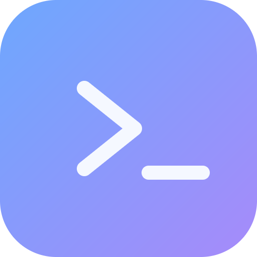

<div align="center">
  
  <h1>Terminal Buddy</h1>
  <p><b>A calm home for your coding agents.</b></p>
  <p><i>Real terminals. Friendly faces. Everything you need to answer, in view.</i></p>
</div>

---

## Why

Running several coding agents at once means keeping track of their terminals, projects, and questions. Terminal Buddy makes those terminals easy to name, recognize, and organize.

Terminal Buddy puts the **live terminal first**, including trust prompts, approval menus, errors, and slash commands. The terminal is the only place to type or paste dictation; Enter, arrows, Escape, and Ctrl+C go directly to the running program. Nothing automatically answers approval questions.

Click the title's pencil to give an instance a local name such as **Praveen's persona**. Labels persist in the workspace without modifying Claude or Codex history files. Tabs and grid cards use the same name.

**Desktop notifications and chimes** are off by default, including the one-time migration from older default-on releases. Opt in through Settings. After submitted input, eight seconds of output silence produces an “output paused” alert; an actual terminal-process exit is labeled separately. Silence is a heuristic, not proof of task completion. Pauses are rate-limited to one notification per terminal every 30 seconds. Clicking an alert opens its live terminal. Settings includes a test button; Windows notification permissions and Do not disturb still apply. Monitoring runs in the main process, including while the app is minimized.

Three things it fixes:

1. **You lose track of which one needs you.** Agents run for minutes, then quietly stop. Terminal Buddy flags the ones that went silent.
2. **You lose your old sessions.** Both CLIs keep every conversation on disk. Terminal Buddy indexes them, and you can drop one onto a card to pick it up.
3. **Important prompts get lost.** The live terminal is the only session view, so no transcript overlay hides questions or menus.

It is a personal tool, published in case it's useful. No telemetry, no account, no server — everything reads from your local disk.

## One terminal, no transcript view

Fresh launches, new windows, **Start fresh** in recovery, and every **+** open a chooser without creating a terminal. Choose **Pick a chat** to browse saved conversations, **Start a new chat** to choose Claude or Codex, **Open folder…** to select the working folder, or **Just start fresh** to launch a plain terminal. Expand **Recent folders, pinned chats & presets** for shortcuts. Pin or unpin conversations in the catalog with **☆ Pin**; pinned chats validate their saved history before reopening. Favorites and recent folders are shared across windows and saved for the next launch. Each fresh chooser starts in your home directory; selecting a folder updates it for the next chat or terminal. The keyboard shortcut, tray action, and command palette use the same chooser. Only an explicit duplicate or saved-chat resume keeps the original folder.

Each instance shows the agent's native terminal output. Terminal Buddy enables truecolor for its child terminals, rather than inheriting a launcher's `NO_COLOR` setting. Colors come from the running program and the selected terminal theme; output is not rewritten into chat bubbles.

A colored header reports **Output active**, **Opening**, **Quiet**, **Take a look**, or **Exited**. These describe observed activity, not confirmed agent completion. There is no separate composer or Send button. Pasted text uses the terminal's paste handling, including bracketed paste when enabled by the running program; Terminal Buddy does not append Enter. Multiline editing and menu behavior belong to the shell or agent.

Saved chats remain in the catalog and can be resumed or exported as Markdown. Dropping one onto an empty pane replaces that terminal in place; existing input and messages protect occupied panes. Background history reading is used only for tool/MCP activity and occupancy tracking, never as a separate session interface.

## Features

**Separate workspace windows**

Click **⊞ New window** in the title bar, use **Ctrl+Shift+N** (**Cmd+Shift+N** on Mac), or choose **New workspace window** in the command palette. Each new window opens the four-option chooser and supports its own terminals, tabs, grid, names, and project folders. The arrow beside New window lists your workspaces and brings the selected window forward, including hidden windows. The tray menu also offers New window.

Terminal input, broadcast typing, activity, and pop-outs stay within their owning workspace. Preferences and the saved-chat catalog are shared. Closing one workspace stops only its terminals and closes its pop-outs; other windows keep running. If Close to tray is enabled, closing hides the workspace and keeps its terminals alive. Quit from the tray or Mac application menu to exit all windows.

On the next launch, windows that were open when you quit reopen with their own recovery choosers, saved names, and layouts. Explicitly closing a workspace removes it from that reopening list; closing the last workspace keeps it for the next launch. Existing single-window saves continue to work. Use **⇥** on a tab or pane to move it to another window, or drag its header outside the current window onto another visible workspace. Dropping outside every workspace still creates a pop-out. Moves keep the running process, terminal output, name, and recovery link; moving a popped-out terminal docks it into the destination. Choose **Workspace windows → Combine all windows here** to collect the terminals and close the emptied windows. The destination keeps its layout. Finish pending recovery choices first; a move that would exceed 16 terminals is rejected before changing any workspace.

**Workspace presets**

Open **Workspace windows → Workspace presets…** (also available from the chooser or command palette). Name the current setup to save its folders, shells, assistant choices, and layout. Opening a preset adds fresh sessions to the current window; it never replays terminal input or resumes the original conversations. Missing folders or shells are reported before launch. If a process launch fails midway, already opened sessions remain and the error offers a retry for the failed terminal. Presets can be removed individually.

**Pop-out terminals**

Drag a tab or a pane's header outside the app to detach it, or click its ↗ button. The separate window can be maximized or moved to another monitor. Drag its **Drag to dock** handle back onto the highlighted strip in its original workspace, click **Dock back**, or close the pop-out to return it. Native title-bar dragging also docks when released over the strip. Escape cancels handle drags. A placeholder keeps the original grid slot and provides Show window / Dock back controls.

Detaching never launches another shell or resumes another chat: the same PTY stays running. A bounded headless xterm screen provides an ordered snapshot including colors, scrollback, cursor state and alternate-screen menus; only the detached window controls its size while it is out. Terminal protocol queries are answered by one parser, not by both views. Input/pasted dictation still uses the native terminal with no automatic Enter. A detached window has no broadcast mode; typing there targets that terminal only. Workspace broadcast explicitly targets that window’s terminals, including its pop-outs.

Closing a pop-out (including Ctrl+Shift+W) docks it instead of stopping its process. To end a terminal, close its pane in its workspace. Quitting the entire app closes all windows and saves every workspace; on the next launch, recovered sessions return to their own workspace rather than reopening pop-outs. Pop-out placement is not persisted. Theme/font changes and local name changes are reflected in open pop-outs.

**Pick up where you left off**

After exiting the entire app, the next launch asks whether to reopen all available sessions, choose individual ones, browse saved chats, or start fresh. Names, folders, ordering, active pane, grid proportions are saved continuously and flushed on normal exit. Closing the app while the chooser is open keeps the previous recovery snapshot. Start fresh clears the reopen list, never the agents' conversation history.

Chats imported from the catalog record their exact Claude/Codex session ID. New Claude chats launched by the chooser receive an explicit ID and become resumable once Claude writes their history. Missing folders/files and known agents without a linked ID are flagged, not silently replaced with another chat. For new Codex chats or agents started manually, click **Link chat** in the terminal header and choose the exact saved conversation. Buddy validates its ID against the history file without restarting the live process. **Linked** reviews or changes that association. Changing conversations inside a CLI (for example `/resume` or `/clear`) does not automatically update the link; select the new conversation with this control. Workspace writes are atomic, with a last-known-good `.bak` fallback for corrupt or invalid snapshots.

This is conversation recovery, not a background terminal daemon: closing the app stops running processes. Unsent input, arbitrary shell state and scrollback are not restored, and previous tasks are not automatically resubmitted. Agent trust/approval prompts remain native terminal interactions. Disable the startup prompt in Settings if desired.

**Friendly terminal cards**
- Live output, questions, and menus stay visible
- One native input surface for typing, pasted dictation, and interactive menus
- Skills can be typed as slash commands or dragged in from the catalog
- Editable header labels, recognizable critters, and smoothly resizable grid rows and columns
- Native ANSI colors and a visible activity label

**Focus and attention**

Use ⛶ or double-click empty header space to fill the main area with one terminal. Escape restores the exact prior grid without restarting any terminal. In focus mode, Escape is reserved for returning to the layout.

A faint amber border pulses on a pane and its tab after an identified agent's output pauses, or a used terminal exits. The light stays on through subsequent output until you click/open the terminal; no reply is required to dismiss it. Pop-outs share the same cue and acknowledgement. Calm mode and the system reduced-motion preference use a steady border. This indicates something to inspect, not confirmed completion or an approval request. World view has been removed; old World workspaces open in Grid with their sessions preserved.

**First-run walkthrough**

A seven-step, skippable tour highlights the app's controls on first launch. Back/Next, Skip, and Escape are supported; completion is saved. A pending recovery chooser is shown first. Replay it from **Settings → Getting started → Replay walkthrough**. The tour never sends commands, launches an agent, or changes your layout.

**The buddy**
- A small creature in the title bar whose mood is real state, not decoration: **asleep** with nothing open, **calm** when all is quiet, **working** while output streams, and visibly **agitated** the moment a pane starts waiting on you. Click it to jump straight to whichever pane that is.
- Five themes — Midnight, Grove, Ember, Bubblegum and Paper (light) — each covering the chrome *and* the terminal palette, so switching never leaves the two halves mismatched.
- **Critters, in five packs.** Forest, Robots, Ocean, Space or Garden. Every card gets a character and a hue, so cards from the same folder stay tellable apart — the difference between counting tiles and recognising them.

**Terminals**
- 1–16 panes, switchable between **tabs** and **grid** at any time (`Ctrl+Shift+G`)
- Auto-detects PowerShell 7, Windows PowerShell, Command Prompt, Git Bash and WSL
- **Attention badges** — an identified agent that produced output and then went quiet gets flagged as needing a look; ordinary shell prompts stay quiet
- **Broadcast mode** — type once, send to every terminal (`Ctrl+Shift+B`)
- **Click to move the cursor** — click any word in the line you're typing and the caret goes there. No arrow-key crawling.
- **Rearrange the grid** — hit the padlock (`Ctrl+Shift+L`) and drag panes onto each other to swap them. Tabs reorder by dragging at any time.
- Rename tabs (double-click), search scrollback (`Ctrl+Shift+F`), reopen your layout on launch
- GPU-accelerated rendering, 5000 lines of scrollback per pane by default

**Catalog** (`Ctrl+Shift+E`)
- **Drag a chat or a skill straight onto a terminal.** Panes that can take it light up green, the rest dim out, and the one under the cursor tells you exactly what will happen.
- **Chats** — every Claude Code and Codex session on disk, newest first, with the title, first prompt, folder, turn count and age. **Resume** launches a terminal in the original folder and runs the resume command for you. **Export .md** writes a clean Markdown transcript.
- **Skills** — every `SKILL.md` from your Claude plugins, user folder and per-project `.claude/skills`, plus Codex prompts. Deduplicated across cached plugin versions.
- **Projects** — every folder you've worked in, derived from your session history. One click opens a terminal there.

**Living on your desktop**
- Installs to the Start menu and desktop like any app — search "Terminal Buddy", or right-click the taskbar icon and **Pin to taskbar**
- A **notification-area icon** with the fleet status in its tooltip, a menu for a new terminal or a recent project, and Quit
- A **count over the taskbar icon** whenever terminals are waiting on you, and a single taskbar flash when one starts
- **Jump list** — right-click the taskbar or Start icon for your recent projects
- Optional **minimise to tray** and **close to tray**, so closing the window doesn't kill eight running agents

**Shell integration**
- **Open in Buddy** on any folder in Explorer
- A `buddy` command for your PATH — `buddy` opens the current folder, `buddy <path>` opens that one
- Opening a second folder adds a tab to the running window instead of launching another copy

## Turning the whimsy down

All of it is in **Settings → Look and feel**, and none of it is load-bearing:

| Setting | Effect |
| --- | --- |
| **Theme** | Five palettes. Pick Paper for daylight, Midnight to keep it sober. |
| **Critters** | Off, and tabs go back to plain numbers. |
| **Chime** | Two soft synthesised notes when a pane starts waiting. **Off by default** — a notification you did not ask for is worse than none. |
| **Calm mode** | Stills every animation, buddy included. |

And under **Settings → Taskbar and tray**: the notification-area icon, minimise-to-tray and close-to-tray, all off-switchable.

`prefers-reduced-motion` is honoured whether or not Calm mode is on. The tone lives in one file, `src/renderer/src/lib/copy.ts`, so it can be flattened in a single edit — and the rule it follows is that the chrome can have a personality while the data never does: counts, paths, ids and errors are always literal.

## Install

Grab the installer or the portable `.exe` from [Releases](../../releases), or build it yourself:

```bash
git clone <this repo>
cd terminal-buddy
npm install
npm run dev          # run it
npm run dist         # build installer + portable into release/
```

Requires Node 18+. **No C++ toolchain needed** — the PTY layer ships prebuilt binaries.

The installer is per-user, needs no admin rights, and adds Start menu and desktop shortcuts. To get it onto the taskbar, launch it once, then right-click its taskbar button → **Pin to taskbar**. (Windows deliberately blocks apps from pinning themselves.)

After first launch, open **Settings (`Ctrl+,`) → Windows integration** and install the context menu and the `buddy` command.

> Install those from the *installed* copy, not a dev build or the unpacked folder — the registry entry stores an absolute path, so it breaks if that folder moves. Re-run them after any move.

> **Windows 11 note:** the context menu entry appears under **“Show more options”** (or `Shift+F10`), not the short default menu. Putting an entry in the top-level Win11 menu requires shipping a signed MSIX package with a COM handler, which is more machinery than this tool warrants.

## Keyboard

| Key | Action |
| --- | --- |
| `Ctrl+Shift+T` | New terminal |
| `Ctrl+Shift+D` | Duplicate terminal (same folder) |
| `Ctrl+Shift+W` | Close terminal |
| `Ctrl+Tab` / `Ctrl+Shift+Tab` | Next / previous |
| `Alt+1` … `Alt+9` | Jump to terminal |
| `Ctrl+Shift+G` | Toggle tabs / grid |
| `Ctrl+Shift+E` | Toggle catalog |
| `Ctrl+Shift+P` | Command palette |
| `Ctrl+Shift+F` | Search in terminal |
| `Ctrl+Shift+B` | Broadcast to all terminals |
| `Ctrl+Shift+L` | Lock / unlock the layout |
| `Ctrl+C` / `Ctrl+V` | Copy / paste |
| `Ctrl+Shift+C` / `Ctrl+Shift+V` | Copy / paste (also works) |
| Right-click | Copy selection, or paste if nothing selected |
| Click / Alt+click | Move the cursor into the line you're typing |
| `Ctrl+,` | Settings |

`Ctrl+C` copies **only when text is selected**; with nothing selected it stays an interrupt, and copying clears the selection so the next press interrupts. Every other bare `Ctrl` combo is left to your shell — `Ctrl+A` still goes to the start of the line, `Ctrl+W` still deletes a word.

### Why Ctrl+V needed fixing

xterm.js treats `Ctrl+V` as the control byte `0x16` and calls `preventDefault()`, which kills the browser's own paste — so the key reached the shell as a raw SYN and appeared to do nothing. On top of that, Electron's default application menu registered `Ctrl+V` as a global accelerator and opened a hidden menu bar on `Alt`, which is why odd `Alt` combinations seemed to paste instead.

Both are gone: the menu is removed (`Menu.setApplicationMenu(null)`) and the app owns every clipboard key itself, routing through Electron's clipboard over IPC rather than `navigator.clipboard`, which needs a permission grant and fails silently without one. See `src/renderer/src/lib/clipboard.ts`.

## How it reads your agent history

Nothing is guessed; both CLIs write structured logs.

| | Claude Code | Codex |
| --- | --- | --- |
| Location | `~/.claude/projects/<slug>/<uuid>.jsonl` | `~/.codex/sessions/YYYY/MM/DD/rollout-*.jsonl` |
| Session id | the filename | `session_meta.payload.session_id` |
| Title | `ai-title` records, else first real prompt | first real user message |
| Folder | `cwd` on user records | `session_meta.payload.cwd` |

Both stores are large — around 300 MB here — so every file is parsed once and cached against its size and mtime. The first scan takes a few seconds with a progress bar; later launches are instant. Parsing streams line by line and only runs `JSON.parse` on lines that could possibly match, so a 20 MB transcript costs a read, not a heap.

Sessions whose only prompts are machinery (sub-agent runs, `/exit`, injected `AGENTS.md` or caveat blocks) are flagged **internal** and hidden behind a toggle — but a session Claude gave a real title is always kept, even if it opens with a caveat block.

The resume commands are **templates** in Settings:

```
claude --resume {id}
codex resume {id}
```

If either CLI changes its flags, that's a settings edit rather than a new release. Codex records both a thread id and a rollout id; the detail view exposes the alternate one if the first doesn't take.

## Architecture

```
main process                      renderer
├─ PtyManager      spawn/write/   ├─ TerminalPane   one xterm per session,
│                  resize/kill,   │                 never unmounted
│                  8ms output     ├─ TerminalArea   tabs ⇄ grid
│                  batching       ├─ Sidebar        catalog + transcripts
├─ CatalogService  streaming      ├─ Palette        fuzzy jump
│                  JSONL index    └─ store          zustand
│                  + mtime cache
├─ ShellIntegration  registry .reg import, PATH via .NET
└─ WindowManager   single-instance lock, argv → new tab
```

Windows shell surfaces — tray, taskbar badge, jump list — live in `src/main/tray.ts`. The badge itself is painted in the renderer (that is where a canvas and the live theme colours are) and handed to main as a data URL.

Three details worth knowing if you fork this:

- **Hidden panes keep their full size.** In tab mode every pane is absolutely positioned at full size and only `visibility` changes. A `display:none` terminal measures as zero, so `fit()` would resize the pty to nonsense on every tab switch.
- **The pid arrives late.** On Windows, ConPTY populates `pty.pid` asynchronously; reading it at spawn always returns `0`. The manager refreshes it when the first output lands and pushes the correction to the UI.
- **The dev build had its own profile.** Running `electron out/main/index.js` doesn't pick up the package name, so Electron fell back to `Electron` and kept a separate settings file, workspace and catalog cache under `%APPDATA%\Electron`. `app.setName('terminal-buddy')` pins both to the same profile — otherwise what you test isn't what ships.
- **`AppUserModelId` must match the installer's `appId`.** Without it Windows treats a pinned shortcut and the running window as two different apps, and the taskbar shows both.

## Editing the line you're typing

Click anywhere in the current command and the cursor moves there — click the third word, fix it, carry on. Alt+click does the same thing and keeps working even if you switch the feature off in **Settings → Terminal**.

Worth knowing how it works, because it explains the edges. A terminal cannot move the shell's cursor directly: the line buffer belongs to the line editor (PSReadLine, readline), not to the terminal. So Buddy measures the distance from the caret to your click and sends exactly that many arrow keys in one burst. iTerm2, VS Code and Windows Terminal all use the same trick. The editor clamps at both ends of its buffer, so clicking into the prompt or past the last character is harmless.

It deliberately does nothing in three cases:

- **Full-screen programs** (vim, less, htop). They own the whole grid and the cursor isn't a text caret, so arrows would be navigation — or worse.
- **When the program asked for mouse events.** The click belongs to it.
- **When the click would need Up or Down.** Those mean *history* to every shell worth using; sending them would silently replace the line you were editing. Clicks within one wrapped line still work, because horizontal arrows walk over the wrap on their own.

A click on an unfocused pane only focuses it. The next click positions.

## Dragging things onto terminals

Grab any row in the catalog and drop it on a pane. Buddy works out what is actually running in each terminal first — by walking the process tree under each shell, not by guessing from output — so the highlighting tells the truth:

| Dropping | On an idle prompt | On a matching agent | On the other agent |
| --- | --- | --- | --- |
| **Chat** | ✅ resumes it there | ❌ already busy | ❌ already busy |
| **Skill** | ✅ starts the agent with the skill | ✅ types `/name` into the session | ❌ wrong agent |

Green ring means it will land, dim means it won't, and the pane under the cursor spells it out: *"Start claude here with /agent-development"*, or *"That terminal is running codex, not claude"*.

Resuming has to shell out, which is why it needs a prompt rather than a live agent — that's the case you described as "if it's not empty, you just have to open it normally", and the invalid drop says so instead of failing silently.

The launch templates live in **Settings → Resume commands**, next to the resume ones:

```
claude "{skill}"      # {skill} becomes /name
codex "{skill}"
```

## Rearranging panes

The grid is locked by default, because a stray drag while you are working should never shuffle six running agents. Click the **padlock** in the title bar (or `Ctrl+Shift+L`) and:

- a shield drops over every pane — terminals keep producing output but stop taking input, so a drag can't be mistaken for a text selection
- each pane grows a grab pill showing its critter and title
- drag a pane over another and the rest **slide out of the way** as you go, the way app icons do — the reorder happens live, not on drop
- **drag a divider between columns or rows** to resize both neighbors continuously; no long drag or off-screen corner is needed
- double-click a divider to balance its neighbors, or focus it and use arrow keys for fine adjustments
- proportions persist across restarts and layout switches; changing the grid's row/column count uses equal sizes for the changed axis

Dividers keep neighboring tracks at least 160px wide or 110px high when space allows. The old whole-cell corner sizing is replaced by a regular grid; terminal order, names, and running processes are preserved.

Movement is animated with a FLIP pass: every pane's position is measured before and after the reflow, then each one starts at its old spot and glides to the new one. Without it a reorder teleports and it's genuinely hard to see what went where. Calm mode turns it off.

Tabs are different: you can drag a tab to reorder it whenever you like, lock or no lock, because there is no way to do that by accident while typing.

## Can I pull an external terminal into Buddy?

Not really, and it is worth being precise about why.

**Reparenting the window** is technically possible — Win32 `SetParent` can graft another app's `HWND` into ours. In practice it is a bad trade: the embedded window floats above Electron's GPU-composited content instead of clipping to its pane, it fights DPI changes and monitor moves, and it needs a native module to call into Win32. Worse, the result would be a foreign window sitting in a hole in the layout: no scrollback search, no attention badge, no critter, none of the things Buddy is for.

**Moving the running process** is not possible at all. A process's stdin/stdout are bound to the ConPTY that created them; there is no Windows API to hand a live console over to a different terminal.

What does work, and covers most of the need:

- **`buddy .`** — run it inside any existing terminal and Buddy opens a pane at that folder. You are one `cd` away from carrying on inside the app.
- **Resume the session.** This is the real answer for agents. A Claude or Codex conversation running in an external window can't be moved, but you can close it and pick it straight back up from the catalog — same folder, same history, now with a critter and an attention badge. That is exactly what the Chats tab is for.

## Limitations

- **Processes don't survive a restart.** Closing the app kills its PTYs. The startup chooser can resume explicitly linked conversations in new processes; it cannot continue an interrupted shell command. Unlinked conversations are available through the catalog.
- macOS has platform-specific shell, agent detection, keyboard, window controls, menu bar, and Dock support. Apple Silicon and Intel builds are checked by `.github/workflows/macos.yml`; run that workflow before treating a Mac release as verified. Explorer integration and the installed `buddy` command remain Windows-only. Linux packaging is experimental.
- Skills are catalogued and searchable, not editable. "Type `/name`" writes the invocation into the focused terminal.

## Development

### Updating Codex inside Terminal Buddy

Click **+ → Just start fresh** to get a normal shell prompt. You can install and update command-line tools there. Close running Codex CLI sessions before updating, then open a new Codex chat afterwards. For an npm installation:

```sh
npm install -g @openai/codex@latest
codex --version
```

Use the update method matching your original installation; see the [official Codex CLI installation instructions](https://learn.chatgpt.com/docs/codex/cli). This updates the CLI; the desktop app has its own updater. If Terminal Buddy cannot open even a **Just start fresh** pane, use PowerShell/Windows Terminal or macOS Terminal to update. Launch errors offer **Retry**, **Choose another shell**, and **Copy error details**. Selecting another shell applies to that retry. The chooser keeps the actual launch error visible; check **Settings → Terminal → Default shell** if it points to a missing shell. A native terminal-module error requires a Terminal Buddy reinstall/build for the correct OS and processor, rather than a Codex update.

### Building for macOS

On a Mac, use Node.js 22 and install dependencies there (do not copy `node_modules` from Windows). Login shells load the Mac user's shell configuration, including PATH setup for Homebrew, npm, and version managers. Finder/Dock launches fall back to the account's configured shell when `SHELL` is missing.

```sh
npm ci
npm run typecheck
npm run test:platform
npm run dist:mac -- --publish never
```

This creates a DMG and ZIP in `release/` for the Mac's processor. Apple Silicon uses `arm64`; Intel uses `x64`. Build on each corresponding architecture so the native PTY dependency matches. The **macOS builds** GitHub Actions workflow does this on both architectures, runs the platform/unit checks, and tests each packaged app by opening a shell, detecting a mock agent, and exercising clipboard/interrupt keys. Download its build artifacts after a successful run. These test artifacts are not Developer ID signed or notarized; public distribution needs Apple signing credentials and notarization configured with [electron-builder](https://www.electron.build/code-signing-mac.html).

On Mac, use **Cmd+C / Cmd+V** to copy/paste and **Control+C** to interrupt. App actions accept **Cmd+Shift** (e.g. Cmd+Shift+T); **Control+Tab** changes panes. The application menu provides Quit/Hide and window actions, and clicking the Dock icon reveals a hidden window. Windows Explorer settings are hidden on Mac. To open a folder from macOS Terminal after installing the app:

```sh
open -a "Terminal Buddy" --args "$PWD"
```

### Commands

```bash
npm run dev         # electron-vite dev server with HMR
npm run typecheck   # tsc over main, preload and renderer
npm run build       # compile to out/
npm run test:platform # platform logic checks on any host
npm run test:platform-app # real PTY, process detection, and keyboard checks
npm run test:windows # ownership, live moves, combining, pop-outs, and recovery
npm run test:launcher # pinned chats, presets, recent folders, and launch recovery
npm test            # typecheck + build + regression suites
```

UI tests drive the **real application** with isolated profiles and local mock agents where needed; unit tests cover persistence, notification timing, and terminal transport. Electron runs in disposable profiles, and the feed fixture gets a disposable home folder, so the suite never resets your actual workspace or writes into your real agent history.

| Script | What it proves |
| --- | --- |
| `npm run test:smoke` | Boots the app over the Chrome DevTools Protocol, spawns a pty and round-trips `echo` through it, confirms the catalog indexed real skills/chats/projects, toggles the sidebar and grid, saves a screenshot. |
| `npm run test:feed` | Writes isolated Claude and Codex transcript fixtures, verifies live tailing and readable tool calls, including Codex MCP server names. |
| `npm run test:grid` | Opens 6 terminals, tiles them, checks every pane has real geometry and a unique critter, and proves ordinary shell prompts do not raise false attention alerts. |
| `npm run test:features` | Verifies first-run/replay/skip walkthrough, legacy layout migration, attention acknowledgement, focus/Escape, and explicit recovery linking. |
| `npm run test:settings` | Verifies opt-in alert migration, saved walkthrough preferences, and corrupt-workspace fallback. |
| `npm run test:registry` | Round-trips the generated `.reg` through the real `reg.exe` under a scratch key (paths with spaces and all), then deletes it. |

The disposable profile also gives test runs their own single-instance lock, so your installed copy can stay open.

Set `BUDDY_EXE` to point the harness at a packaged or installed build instead of `out/`:

```bash
BUDDY_EXE="$LOCALAPPDATA/Programs/Terminal Buddy/Terminal Buddy.exe" npm run test:smoke
```

Regenerate the robot icon with `npm run icon` (Node, no image libraries needed). Distribution builds regenerate the Windows and tray icons automatically.

## License

MIT
